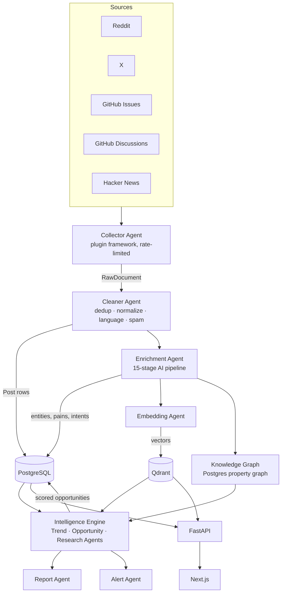

# Kampher Architecture

## 1. Design principles

1. **Data is fuel, reasoning is the product.** Collectors are deliberately boring; all
   differentiation lives in the enrichment pipeline and the intelligence engine.
2. **Every layer is replaceable.** Collectors, LLM provider, embedding provider, vector
   store, and graph store are all behind interfaces. Swapping Qdrant for pgvector, or
   Claude for another model, touches one adapter.
3. **Cost-gated intelligence.** At hundreds of millions of documents, LLM calls are the
   dominant cost. Cheap deterministic stages (language, spam, dedup, signal pre-filter)
   run first and discard the majority of documents before a single expensive token is spent.
4. **No black-box numbers.** Every score is a structured object:
   `{value, confidence, reasoning, evidence[]}`. The explanation is produced in the same
   model call as the number, so it can never drift from it.
5. **Agents are queues, not threads.** Each background agent is a Celery worker bound to a
   named queue. Scaling an agent = adding worker replicas for its queue.

## 2. Data flow

## 3. Collector layer

Every source implements `BaseCollector`:

- `source_name`, `default_schedule`
- `collect(cursor) -> AsyncIterator[RawDocument]`
- built-in **token-bucket rate limiter** and **exponential backoff with jitter**

All collectors emit **one schema** (`RawDocument`): source, external id, url, author,
title, body, thread linkage, engagement metrics, raw payload. Normalization happens at the
edge so nothing downstream knows what a "subreddit" is.

A **registry** maps `source_name -> collector class`. Adding Stack Overflow later is one
file + one registry entry; schedulers, dedup, and the pipeline are untouched.

Cursors (per-source sync state) are persisted in `source_cursors`, so collection is
incremental and resumable.

## 4. Storage

### PostgreSQL (system of record)

Normalized relational schema (see `backend/app/models/`):

- **Content:** `posts`, `comments`, `authors`, `source_cursors`
- **Taxonomy:** `topics`, `industries` (seeded, extensible)
- **Entities:** `companies`, `products`, `technologies`, `entity_mentions`
- **Intelligence:** `problems`, `pain_clusters`, `feature_requests`,
  `opportunities`, `opportunity_scores`, `opportunity_reports`, `trend_snapshots`
- **Graph:** `graph_nodes`, `graph_edges`
- **Enrichment bookkeeping:** `enrichments` (per-post stage output + pipeline version)

Pipeline outputs are versioned (`pipeline_version` on enrichments) so stages can be
re-run and back-filled without ambiguity.

### Qdrant (semantic memory)

Named collections: `posts`, `comments`, `problems`, `pain_clusters`,
`feature_requests`, `opportunities`. Payloads carry the Postgres id + filterable fields
(source, industry, topic, created_at) so hybrid search filters run inside Qdrant.

### Knowledge graph — why Postgres, not Neo4j

The graph is a **property graph in two tables** (`graph_nodes(id, kind, key, props)`,
`graph_edges(src, dst, relation, weight, props)`) with recursive-CTE traversal wrapped by
`GraphService`. Rationale: node/edge cardinality stays within Postgres' comfort zone for
years, transactional consistency with the relational data is free, and it's one fewer
stateful system to operate. The service interface is deliberately storage-agnostic; if
traversal depth or scale outgrows CTEs, Neo4j slots in behind the same interface.

Node kinds: `problem, industry, product, company, author, technology, feature,
competitor, pain_point, trend, topic`.
Relations: `EXPERIENCES, BELONGS_TO, COMPETES_WITH, MENTIONS, REQUESTS, SOLVES,
BUILT_WITH, TRENDING_IN, COMPLAINS_ABOUT`.

## 5. AI pipeline

Stages implement a common protocol (`Stage`): `name`, `should_run(ctx)`,
`run(ctx) -> StageResult`. A `PipelineRunner` executes them in dependency order, persists
each result, and short-circuits when a gate stage rejects the document.

| # | Stage | Kind | Notes |
|---|-------|------|-------|
| 1 | Language detection | local (lingua) | gate: non-target languages stop here |
| 2 | Spam detection | heuristics + LLM escalation | gate |
| 3 | Topic classification | LLM structured | taxonomy-constrained |
| 4 | Industry classification | LLM structured | taxonomy-constrained |
| 5 | Entity extraction | LLM structured | companies, products, people, technologies |
| 6 | Pain detection | LLM structured | pain intensity 0–1 + evidence spans |
| 7 | Emotion detection | LLM structured | frustration, anger, desperation, … |
| 8 | Intent detection | LLM structured | buying/complaining/comparing/requesting/recommending/leaving |
| 9 | Problem extraction | LLM structured | canonical problem statement |
| 10 | Solution extraction | LLM structured | current workarounds mentioned |
| 11 | Feature request extraction | LLM structured | explicit asks |
| 12 | Opportunity generation | LLM, cluster-level | runs on pain clusters, not single posts |
| 13 | Trend scoring | statistical + LLM | velocity/acceleration over trend snapshots |
| 14 | Business scoring | LLM structured | all scores with reasoning + evidence |
| 15 | Market estimation | LLM structured | TAM band + comparables, confidence-tagged |

Stages 3–11 are **document-level**; 12–15 are **cluster/opportunity-level** and run in the
intelligence agents. Document-level LLM stages share one batched extraction call per
document where schemas allow, cutting cost ~6× while keeping stages independently
re-runnable (each stage knows how to extract its slice and can also run standalone).

**Cost gates:** stage 2 output plus a cheap signal heuristic (`has_pain_signal`) decide
whether stages 6–11 run at all. Informational content gets topics/entities only.

## 6. Clustering: from posts to opportunities

1. Every extracted `problem` is embedded.
2. The Opportunity Agent runs incremental similarity clustering in Qdrant
   (threshold-based assignment to nearest `pain_cluster` centroid; new cluster if below
   threshold; periodic re-centroid).
3. Clusters above a support threshold trigger **opportunity generation** (stage 12) with
   the cluster's top evidence posts in context.
4. Stages 13–15 score the opportunity; the Research Agent attaches competitor/market
   context via the knowledge graph + semantic search.

## 7. Scoring model

Each opportunity carries nine scores. Each is stored as its own row
(`opportunity_scores`) with `value (0–100)`, `confidence (0–1)`, `reasoning` (model
explanation), and `evidence` (post ids + quoted spans). Scores:

`pain, trend, opportunity, competition, novelty, revenue_potential,
virality_potential, market_size, confidence` (composite).

The composite `opportunity_score` is a documented weighted blend, recomputed
deterministically from the component scores — never a second model guess.

## 8. Search

- **Keyword:** Postgres full-text (`tsvector` GIN) over posts/opportunities.
- **Semantic:** Qdrant ANN over the query embedding.
- **Hybrid:** Reciprocal Rank Fusion of both result lists.
- **AI chat:** conversational layer that plans → retrieves (hybrid + graph) → answers with
  citations to underlying posts/opportunities.

## 9. API surface

`/health`, `/sources`, `/posts`, `/opportunities` (+ `/scores`, `/evidence`),
`/search` (mode=keyword|semantic|hybrid), `/chat`, `/trends`, `/reports`,
`/industries`, `/graph/neighbors`. All responses are typed Pydantic schemas; pagination is
cursor-based.

## 10. Operations

- **Config:** pydantic-settings, 12-factor, `.env` in dev.
- **Logging:** structlog JSON in prod, pretty console in dev; request ids propagate
  through Celery tasks.
- **Health:** `/health/live` (process), `/health/ready` (Postgres, Redis, Qdrant probes).
- **Errors:** typed exception hierarchy → RFC 7807 problem responses.
- **CI:** ruff, mypy, pytest, frontend lint+build.
